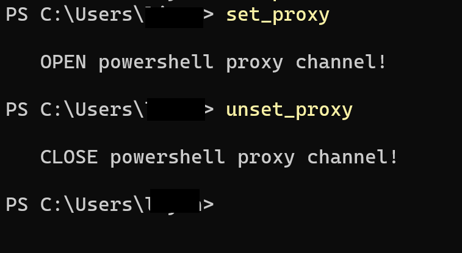

下面是 powershell 脚本，在本地创建一个 .ps1 为结尾的文件，并添加这些内容：

```powershell
function set_proxy {
    $proxy = 'http://127.0.0.1:21882'

    # temporary
    $env:HTTP_PROXY = $proxy
    $env:HTTPS_PROXY = $proxy

    # forever
    # [System.Environment]::SetEnvironmentVariable("HTTP_PROXY", $proxy, "User")
    # [System.Environment]::SetEnvironmentVariable("HTTPS_PROXY", $proxy, "User")
    
    Write-Host "`n   OPEN powershell proxy channel!`n"
}

function unset_proxy {
    # temporary
    Remove-Item env:HTTP_PROXY
    Remove-Item env:HTTPS_PROXY

    # forever
    # [Environment]::SetEnvironmentVariable('http_proxy', $null, 'User')
    # [Environment]::SetEnvironmentVariable('https_proxy', $null, 'User')

    Write-Host "`n   CLOSE powershell proxy channel!`n"
}
```

为了方便使用，可以在个人配置文件中添加这些代码:

```powershell
. D:\YOUR_COMMON_SCRIPT_PATH\set_proxy.ps1
```

这样每次启动 powershell 时都会自动执行，将 `set_proxy` 和 `unset_proxy` 添加进会话。

这样可以通过直接执行这些代码使代理切换生效

